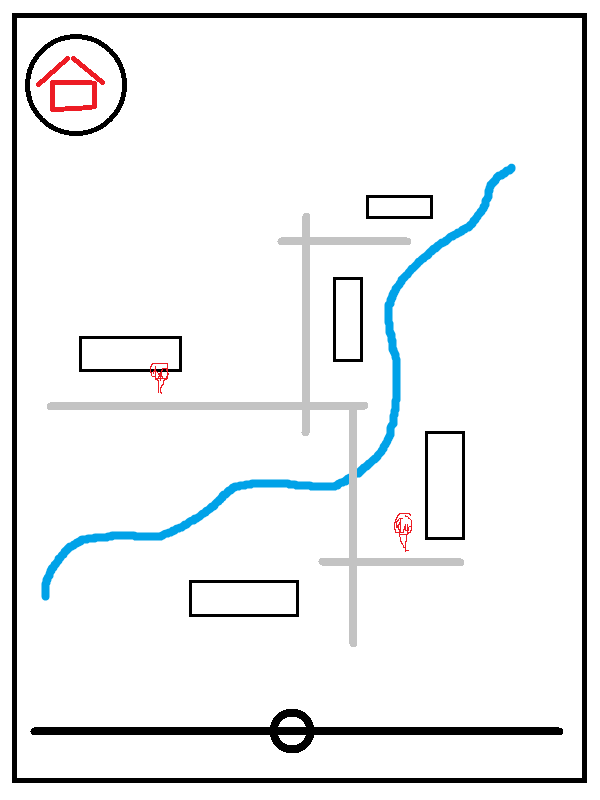

# Дизайн приложения <приложение нейм>

## Название: 

А вот хз. Придумать надо.

## Основная идея:

Приложение позволяет пользователям найти на карте ближайшие лавочки, добавленные другими пользователями и, соответственно, добавить лавочки самим.

# Список экранов

* Авторизация
* Карта
* Личный кабинет 
* Настройки
* Поиск лавочки
* Результаты поиска
* Экран лавочки

# Описание экранов

## Авторизация

Обычное окно авторизации. Логин пароль, всё как у людей.

## Карта

Основное окно. На нём отображается карта с отмеченными лавочками. С этого окна можно перейти в личный кабмнет, найти лавочку и добавить лавочку.

  

Домик - переход в личный кабинет. Лупа - поиск лавочки. Плюсик - добавление лавочки. Иконки для примера, можно (даже скорее нужно) поменять.

## Личный кабинет  

Информация о профиле, сколько лавочек добавил, то, сё. С этого экрана можно перейти в настройки.

## Настройки

Экран настроек. Единственное что мне в голову приходит - добавить тёмную тему (модно же). На сколько это сложно - не знаю.

## Поиск лавочки

При нажатии на кнопку поиска лавочки появляется ползунок, двигая который можно выставить расстояние до лавочки. Здесь я пока не знаю как лучше реализовать подтверждение выбора. Ещё нужно где-то показывать расстояние, в радиусе которого будут искаться лавочки.

 

## Результаты поиска

Результаты поиска выдаются в виде ленты. В ленте расстояние до лавочки, описание (добавленное пользователем), рейтинг (возможно). При нажатии на лавочку переходим на карту, строим маршрут до лавочки.

 

## Экран лавочки

Информативный экран, открывается при нажатии на маркер лавочки на карте. Пользователь может оставить комментарии, поставить оценку. Здесь-же есть кнопка "здесь больше нет лавочки". По нажатии на неё лавочка не удаляется, но если её нажало большое количество пользователей, такая лавочка по особенному отмечается в поиске, например, красным цветом или специальным значком.

# Диаграмма переходов между экранами

# Дополнительные фичи

Возможность оставлять сообщения, которые будут закреплены у лавочки определённое время.

# Комментарии 

Я даже близко не UX/UI дизайнер, так что хз как это сделать нормально. Это прям совсем черновик, как я совсем грубо себе это вижу. Предложения/пожелания приветствуются. 
